```python
import numpy as np
import pandas as pd
```


```python
import matplotlib.pyplot as plt
import seaborn as sns
sns.set_style('whitegrid')
%matplotlib inline
```

** Read in the csv file as a dataframe called df **


```python
df = pd.read_csv("911.csv")
```


```python
df.info()
```

    <class 'pandas.core.frame.DataFrame'>
    RangeIndex: 99492 entries, 0 to 99491
    Data columns (total 9 columns):
     #   Column     Non-Null Count  Dtype  
    ---  ------     --------------  -----  
     0   lat        99492 non-null  float64
     1   lng        99492 non-null  float64
     2   desc       99492 non-null  object 
     3   zip        86637 non-null  float64
     4   title      99492 non-null  object 
     5   timeStamp  99492 non-null  object 
     6   twp        99449 non-null  object 
     7   addr       98973 non-null  object 
     8   e          99492 non-null  int64  
    dtypes: float64(3), int64(1), object(5)
    memory usage: 6.8+ MB
    


```python
df.head(3)
```


<div>
<style scoped>
    .dataframe tbody tr th:only-of-type {
        vertical-align: middle;
    }

    .dataframe tbody tr th {
        vertical-align: top;
    }

    .dataframe thead th {
        text-align: right;
    }
</style>
<table border="1" class="dataframe">
  <thead>
    <tr style="text-align: right;">
      <th></th>
      <th>lat</th>
      <th>lng</th>
      <th>desc</th>
      <th>zip</th>
      <th>title</th>
      <th>timeStamp</th>
      <th>twp</th>
      <th>addr</th>
      <th>e</th>
    </tr>
  </thead>
  <tbody>
    <tr>
      <th>0</th>
      <td>40.297876</td>
      <td>-75.581294</td>
      <td>REINDEER CT &amp; DEAD END;  NEW HANOVER; Station ...</td>
      <td>19525.0</td>
      <td>EMS: BACK PAINS/INJURY</td>
      <td>2015-12-10 17:40:00</td>
      <td>NEW HANOVER</td>
      <td>REINDEER CT &amp; DEAD END</td>
      <td>1</td>
    </tr>
    <tr>
      <th>1</th>
      <td>40.258061</td>
      <td>-75.264680</td>
      <td>BRIAR PATH &amp; WHITEMARSH LN;  HATFIELD TOWNSHIP...</td>
      <td>19446.0</td>
      <td>EMS: DIABETIC EMERGENCY</td>
      <td>2015-12-10 17:40:00</td>
      <td>HATFIELD TOWNSHIP</td>
      <td>BRIAR PATH &amp; WHITEMARSH LN</td>
      <td>1</td>
    </tr>
    <tr>
      <th>2</th>
      <td>40.121182</td>
      <td>-75.351975</td>
      <td>HAWS AVE; NORRISTOWN; 2015-12-10 @ 14:39:21-St...</td>
      <td>19401.0</td>
      <td>Fire: GAS-ODOR/LEAK</td>
      <td>2015-12-10 17:40:00</td>
      <td>NORRISTOWN</td>
      <td>HAWS AVE</td>
      <td>1</td>
    </tr>
  </tbody>
</table>
</div>


# ** Top 5 zipcodes for 911 calls **


```python
df['zip'].value_counts().head(5)
```


    19401.0    6979
    19464.0    6643
    19403.0    4854
    19446.0    4748
    19406.0    3174
    Name: zip, dtype: int64


** What are the top 5 townships (twp) for 911 calls? **


```python
df['twp'].value_counts().head(5)
```


    LOWER MERION    8443
    ABINGTON        5977
    NORRISTOWN      5890
    UPPER MERION    5227
    CHELTENHAM      4575
    Name: twp, dtype: int64


**Unique title codes are there **


```python
df['title'].nunique()
```


    110


## Creating new features

** In the titles column there are "Reasons/Departments" specified before the title code. These are EMS, Fire, and Traffic. Use .apply() with a custom lambda expression to create a new column called "Reason" that contains this string value.** 


```python
df['Reason'] = df['title'].apply(lambda x:x.split(':')[0])
```

** Common Reason for a 911 call based off of this new column **


```python
df['Reason'].value_counts()
```


    EMS        48877
    Traffic    35695
    Fire       14920
    Name: Reason, dtype: int64


** Using seaborn to create a countplot of 911 calls by Reason. **


```python
sns.countplot(x='Reason',data=df,palette='viridis')
```


    <AxesSubplot:xlabel='Reason', ylabel='count'>


    
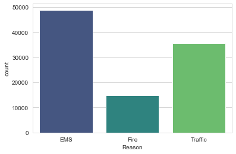
    


** Now let us begin to focus on time information.The data type of the objects in the timeStamp column **


```python
type(df['timeStamp'].iloc[0])
```


    str


** You should have seen that these timestamps are still strings. Use [pd.to_datetime](http://pandas.pydata.org/pandas-docs/stable/generated/pandas.to_datetime.html) to convert the column from strings to DateTime objects. **


```python
df['timeStamp'] = pd.to_datetime(df['timeStamp'])
```

** Grab specific attributes from a Datetime object by calling them.**


```python
df['Hour'] = df['timeStamp'].apply(lambda time: time.hour)
df['Month'] = df['timeStamp'].apply(lambda time: time.month)
df['Day of Week'] = df['timeStamp'].apply(lambda time: time.dayofweek)
df.head(5)
```


<div>
<style scoped>
    .dataframe tbody tr th:only-of-type {
        vertical-align: middle;
    }

    .dataframe tbody tr th {
        vertical-align: top;
    }

    .dataframe thead th {
        text-align: right;
    }
</style>
<table border="1" class="dataframe">
  <thead>
    <tr style="text-align: right;">
      <th></th>
      <th>lat</th>
      <th>lng</th>
      <th>desc</th>
      <th>zip</th>
      <th>title</th>
      <th>timeStamp</th>
      <th>twp</th>
      <th>addr</th>
      <th>e</th>
      <th>Reason</th>
      <th>Hour</th>
      <th>Month</th>
      <th>Day of Week</th>
    </tr>
  </thead>
  <tbody>
    <tr>
      <th>0</th>
      <td>40.297876</td>
      <td>-75.581294</td>
      <td>REINDEER CT &amp; DEAD END;  NEW HANOVER; Station ...</td>
      <td>19525.0</td>
      <td>EMS: BACK PAINS/INJURY</td>
      <td>2015-12-10 17:40:00</td>
      <td>NEW HANOVER</td>
      <td>REINDEER CT &amp; DEAD END</td>
      <td>1</td>
      <td>EMS</td>
      <td>17</td>
      <td>12</td>
      <td>3</td>
    </tr>
    <tr>
      <th>1</th>
      <td>40.258061</td>
      <td>-75.264680</td>
      <td>BRIAR PATH &amp; WHITEMARSH LN;  HATFIELD TOWNSHIP...</td>
      <td>19446.0</td>
      <td>EMS: DIABETIC EMERGENCY</td>
      <td>2015-12-10 17:40:00</td>
      <td>HATFIELD TOWNSHIP</td>
      <td>BRIAR PATH &amp; WHITEMARSH LN</td>
      <td>1</td>
      <td>EMS</td>
      <td>17</td>
      <td>12</td>
      <td>3</td>
    </tr>
    <tr>
      <th>2</th>
      <td>40.121182</td>
      <td>-75.351975</td>
      <td>HAWS AVE; NORRISTOWN; 2015-12-10 @ 14:39:21-St...</td>
      <td>19401.0</td>
      <td>Fire: GAS-ODOR/LEAK</td>
      <td>2015-12-10 17:40:00</td>
      <td>NORRISTOWN</td>
      <td>HAWS AVE</td>
      <td>1</td>
      <td>Fire</td>
      <td>17</td>
      <td>12</td>
      <td>3</td>
    </tr>
    <tr>
      <th>3</th>
      <td>40.116153</td>
      <td>-75.343513</td>
      <td>AIRY ST &amp; SWEDE ST;  NORRISTOWN; Station 308A;...</td>
      <td>19401.0</td>
      <td>EMS: CARDIAC EMERGENCY</td>
      <td>2015-12-10 17:40:01</td>
      <td>NORRISTOWN</td>
      <td>AIRY ST &amp; SWEDE ST</td>
      <td>1</td>
      <td>EMS</td>
      <td>17</td>
      <td>12</td>
      <td>3</td>
    </tr>
    <tr>
      <th>4</th>
      <td>40.251492</td>
      <td>-75.603350</td>
      <td>CHERRYWOOD CT &amp; DEAD END;  LOWER POTTSGROVE; S...</td>
      <td>NaN</td>
      <td>EMS: DIZZINESS</td>
      <td>2015-12-10 17:40:01</td>
      <td>LOWER POTTSGROVE</td>
      <td>CHERRYWOOD CT &amp; DEAD END</td>
      <td>1</td>
      <td>EMS</td>
      <td>17</td>
      <td>12</td>
      <td>3</td>
    </tr>
  </tbody>
</table>
</div>


** Notice how the Day of Week is an integer 0-6. Use the .map() with this dictionary to map the actual string names to the day of the week: **

    dmap = {0:'Mon',1:'Tue',2:'Wed',3:'Thu',4:'Fri',5:'Sat',6:'Sun'}


```python
dmap = {0:'Mon',1:'Tue',2:'Wed',3:'Thu',4:'Fri',5:'Sat',6:'Sun'}
```


```python
df['Day'] = df['Day of Week'].map(dmap)
```

** Using seaborn to create a countplot of the Day of Week column with the hue based off of the Reason column. **


```python
sns.countplot(x="Day of Week", data=df, hue='Reason', palette='viridis')
# To relocate the legend
plt.legend(bbox_to_anchor=(1.05, 1), loc=2, borderaxespad=0.)
```


    <matplotlib.legend.Legend at 0x1e52b2a1160>


    
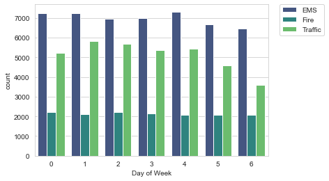
    


```python
sns.countplot(x="Month", data=df, hue='Reason', palette='viridis')
# To relocate the legend
plt.legend(bbox_to_anchor=(1.05, 1), loc=2, borderaxespad=0.)
```


    <matplotlib.legend.Legend at 0x1e52ad17730>


    
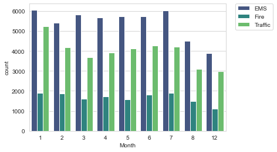
    


**Did you notice something strange about the Plot?**


** Some months are missing, let's see if we can maybe fill in this information by plotting the information in another way, possibly a simple line plot that fills in the missing months, in order to do this, we'll do some work with pandas... **

** Now creating a gropuby object called byMonth, where group the DataFrame by the month column and using the count() method for aggregation. Using the head() method on this returned DataFrame. **


```python
byMonth = df.groupby('Month').count()
byMonth.head()
```


<div>
<style scoped>
    .dataframe tbody tr th:only-of-type {
        vertical-align: middle;
    }

    .dataframe tbody tr th {
        vertical-align: top;
    }

    .dataframe thead th {
        text-align: right;
    }
</style>
<table border="1" class="dataframe">
  <thead>
    <tr style="text-align: right;">
      <th></th>
      <th>lat</th>
      <th>lng</th>
      <th>desc</th>
      <th>zip</th>
      <th>title</th>
      <th>timeStamp</th>
      <th>twp</th>
      <th>addr</th>
      <th>e</th>
      <th>Reason</th>
      <th>Hour</th>
      <th>Day of Week</th>
      <th>Day</th>
    </tr>
    <tr>
      <th>Month</th>
      <th></th>
      <th></th>
      <th></th>
      <th></th>
      <th></th>
      <th></th>
      <th></th>
      <th></th>
      <th></th>
      <th></th>
      <th></th>
      <th></th>
      <th></th>
    </tr>
  </thead>
  <tbody>
    <tr>
      <th>1</th>
      <td>13205</td>
      <td>13205</td>
      <td>13205</td>
      <td>11527</td>
      <td>13205</td>
      <td>13205</td>
      <td>13203</td>
      <td>13096</td>
      <td>13205</td>
      <td>13205</td>
      <td>13205</td>
      <td>13205</td>
      <td>13205</td>
    </tr>
    <tr>
      <th>2</th>
      <td>11467</td>
      <td>11467</td>
      <td>11467</td>
      <td>9930</td>
      <td>11467</td>
      <td>11467</td>
      <td>11465</td>
      <td>11396</td>
      <td>11467</td>
      <td>11467</td>
      <td>11467</td>
      <td>11467</td>
      <td>11467</td>
    </tr>
    <tr>
      <th>3</th>
      <td>11101</td>
      <td>11101</td>
      <td>11101</td>
      <td>9755</td>
      <td>11101</td>
      <td>11101</td>
      <td>11092</td>
      <td>11059</td>
      <td>11101</td>
      <td>11101</td>
      <td>11101</td>
      <td>11101</td>
      <td>11101</td>
    </tr>
    <tr>
      <th>4</th>
      <td>11326</td>
      <td>11326</td>
      <td>11326</td>
      <td>9895</td>
      <td>11326</td>
      <td>11326</td>
      <td>11323</td>
      <td>11283</td>
      <td>11326</td>
      <td>11326</td>
      <td>11326</td>
      <td>11326</td>
      <td>11326</td>
    </tr>
    <tr>
      <th>5</th>
      <td>11423</td>
      <td>11423</td>
      <td>11423</td>
      <td>9946</td>
      <td>11423</td>
      <td>11423</td>
      <td>11420</td>
      <td>11378</td>
      <td>11423</td>
      <td>11423</td>
      <td>11423</td>
      <td>11423</td>
      <td>11423</td>
    </tr>
  </tbody>
</table>
</div>


** Now creating a simple plot off of the dataframe indicating the count of calls per month. **


```python
# Could be any column
byMonth['twp'].plot()
```


    <AxesSubplot:xlabel='Month'>


    
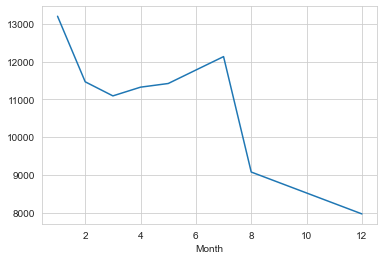
    


** Now see if can use seaborn's lmplot() to create a linear fit on the number of calls per month. Keep in mind you may need to reset the index to a column. **


```python
sns.lmplot(x='Month',y='twp',data=byMonth.reset_index())
```


    <seaborn.axisgrid.FacetGrid at 0x1e52b2a1a90>


    
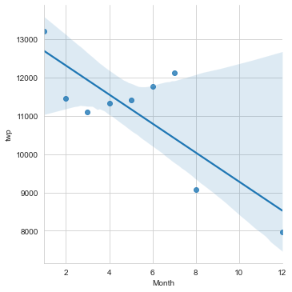
    


**Creating a new column called 'Date' that contains the date from the timeStamp column. We'll need to use apply along with the .date() method. ** 


```python
df['Date']=df['timeStamp'].apply(lambda x:x.date())
```

** Now groupby this Date column with the count() aggregate and creating a plot of counts of 911 calls.**


```python
df.groupby('Date').count()['twp'].plot()
plt.tight_layout()
```


    
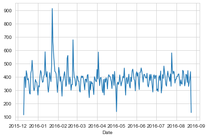
    


** Now recreating this plot but creating 3 separate plots with each plot representing a Reason for the 911 call**


```python
df[df['Reason']=='Traffic'].groupby('Date').count()['twp'].plot()
plt.title('Traffic')
plt.tight_layout()
```


    
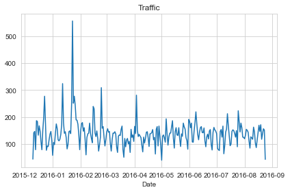
    


```python
df[df['Reason']=='Fire'].groupby('Date').count()['twp'].plot()
plt.title('Fire')
plt.tight_layout()
```


    
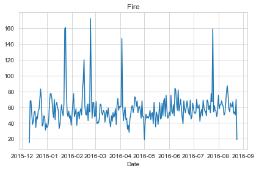
    


```python
df[df['Reason']=='EMS'].groupby('Date').count()['twp'].plot()
plt.title('EMS')
plt.tight_layout()
```


    
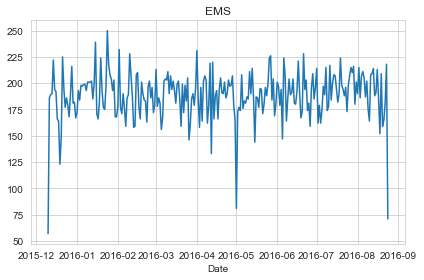
    


____
** Now let's move on to creating  heatmaps with seaborn and our data. We'll first need to restructure the dataframe so that the columns become the Hours and the Index becomes the Day of the Week. There are lots of ways to do this, but I am trying to combine groupby with an [unstack](http://pandas.pydata.org/pandas-docs/stable/generated/pandas.DataFrame.unstack.html) method. **


```python
dayHour = df.groupby(by=['Day of Week','Hour']).count()['Reason'].unstack()
dayHour.head()
```


<div>
<style scoped>
    .dataframe tbody tr th:only-of-type {
        vertical-align: middle;
    }

    .dataframe tbody tr th {
        vertical-align: top;
    }

    .dataframe thead th {
        text-align: right;
    }
</style>
<table border="1" class="dataframe">
  <thead>
    <tr style="text-align: right;">
      <th>Hour</th>
      <th>0</th>
      <th>1</th>
      <th>2</th>
      <th>3</th>
      <th>4</th>
      <th>5</th>
      <th>6</th>
      <th>7</th>
      <th>8</th>
      <th>9</th>
      <th>...</th>
      <th>14</th>
      <th>15</th>
      <th>16</th>
      <th>17</th>
      <th>18</th>
      <th>19</th>
      <th>20</th>
      <th>21</th>
      <th>22</th>
      <th>23</th>
    </tr>
    <tr>
      <th>Day of Week</th>
      <th></th>
      <th></th>
      <th></th>
      <th></th>
      <th></th>
      <th></th>
      <th></th>
      <th></th>
      <th></th>
      <th></th>
      <th></th>
      <th></th>
      <th></th>
      <th></th>
      <th></th>
      <th></th>
      <th></th>
      <th></th>
      <th></th>
      <th></th>
      <th></th>
    </tr>
  </thead>
  <tbody>
    <tr>
      <th>0</th>
      <td>282</td>
      <td>221</td>
      <td>201</td>
      <td>194</td>
      <td>204</td>
      <td>267</td>
      <td>397</td>
      <td>653</td>
      <td>819</td>
      <td>786</td>
      <td>...</td>
      <td>869</td>
      <td>913</td>
      <td>989</td>
      <td>997</td>
      <td>885</td>
      <td>746</td>
      <td>613</td>
      <td>497</td>
      <td>472</td>
      <td>325</td>
    </tr>
    <tr>
      <th>1</th>
      <td>269</td>
      <td>240</td>
      <td>186</td>
      <td>170</td>
      <td>209</td>
      <td>239</td>
      <td>415</td>
      <td>655</td>
      <td>889</td>
      <td>880</td>
      <td>...</td>
      <td>943</td>
      <td>938</td>
      <td>1026</td>
      <td>1019</td>
      <td>905</td>
      <td>731</td>
      <td>647</td>
      <td>571</td>
      <td>462</td>
      <td>274</td>
    </tr>
    <tr>
      <th>2</th>
      <td>250</td>
      <td>216</td>
      <td>189</td>
      <td>209</td>
      <td>156</td>
      <td>255</td>
      <td>410</td>
      <td>701</td>
      <td>875</td>
      <td>808</td>
      <td>...</td>
      <td>904</td>
      <td>867</td>
      <td>990</td>
      <td>1037</td>
      <td>894</td>
      <td>686</td>
      <td>668</td>
      <td>575</td>
      <td>490</td>
      <td>335</td>
    </tr>
    <tr>
      <th>3</th>
      <td>278</td>
      <td>202</td>
      <td>233</td>
      <td>159</td>
      <td>182</td>
      <td>203</td>
      <td>362</td>
      <td>570</td>
      <td>777</td>
      <td>828</td>
      <td>...</td>
      <td>876</td>
      <td>969</td>
      <td>935</td>
      <td>1013</td>
      <td>810</td>
      <td>698</td>
      <td>617</td>
      <td>553</td>
      <td>424</td>
      <td>354</td>
    </tr>
    <tr>
      <th>4</th>
      <td>275</td>
      <td>235</td>
      <td>191</td>
      <td>175</td>
      <td>201</td>
      <td>194</td>
      <td>372</td>
      <td>598</td>
      <td>742</td>
      <td>752</td>
      <td>...</td>
      <td>932</td>
      <td>980</td>
      <td>1039</td>
      <td>980</td>
      <td>820</td>
      <td>696</td>
      <td>667</td>
      <td>559</td>
      <td>514</td>
      <td>474</td>
    </tr>
  </tbody>
</table>
<p>5 rows × 24 columns</p>
</div>


** Now creating a HeatMap using this new DataFrame. **


```python
plt.figure(figsize=(12,6))
sns.heatmap(dayHour,cmap="viridis")
```


    <AxesSubplot:xlabel='Hour', ylabel='Day of Week'>


    
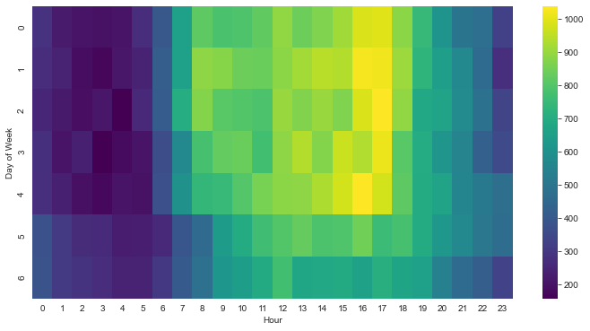
    


** Now creating a clustermap using this DataFrame. **


```python
sns.clustermap(dayHour, cmap='viridis')
```


    <seaborn.matrix.ClusterGrid at 0x1e52aca7b50>


    
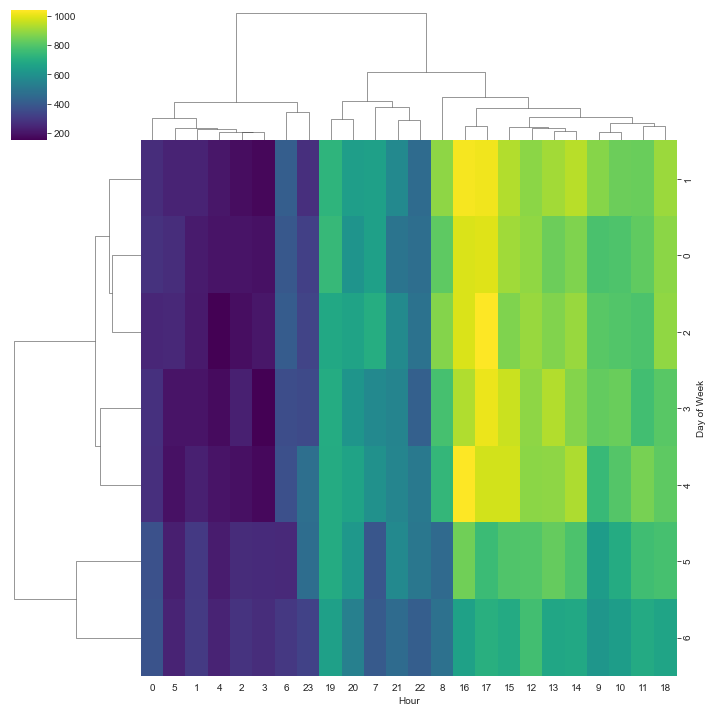
    


** Now repeating these same plots and operations, for a DataFrame that shows the Month as the column. **


```python
dayMonth = df.groupby(by=['Day of Week','Month']).count()['Reason'].unstack()
dayMonth.head()
```


<div>
<style scoped>
    .dataframe tbody tr th:only-of-type {
        vertical-align: middle;
    }

    .dataframe tbody tr th {
        vertical-align: top;
    }

    .dataframe thead th {
        text-align: right;
    }
</style>
<table border="1" class="dataframe">
  <thead>
    <tr style="text-align: right;">
      <th>Month</th>
      <th>1</th>
      <th>2</th>
      <th>3</th>
      <th>4</th>
      <th>5</th>
      <th>6</th>
      <th>7</th>
      <th>8</th>
      <th>12</th>
    </tr>
    <tr>
      <th>Day of Week</th>
      <th></th>
      <th></th>
      <th></th>
      <th></th>
      <th></th>
      <th></th>
      <th></th>
      <th></th>
      <th></th>
    </tr>
  </thead>
  <tbody>
    <tr>
      <th>0</th>
      <td>1727</td>
      <td>1964</td>
      <td>1535</td>
      <td>1598</td>
      <td>1779</td>
      <td>1617</td>
      <td>1692</td>
      <td>1511</td>
      <td>1257</td>
    </tr>
    <tr>
      <th>1</th>
      <td>1973</td>
      <td>1753</td>
      <td>1884</td>
      <td>1430</td>
      <td>1918</td>
      <td>1676</td>
      <td>1670</td>
      <td>1612</td>
      <td>1234</td>
    </tr>
    <tr>
      <th>2</th>
      <td>1700</td>
      <td>1903</td>
      <td>1889</td>
      <td>1517</td>
      <td>1538</td>
      <td>2058</td>
      <td>1717</td>
      <td>1295</td>
      <td>1262</td>
    </tr>
    <tr>
      <th>3</th>
      <td>1584</td>
      <td>1596</td>
      <td>1900</td>
      <td>1601</td>
      <td>1590</td>
      <td>2065</td>
      <td>1646</td>
      <td>1230</td>
      <td>1266</td>
    </tr>
    <tr>
      <th>4</th>
      <td>1970</td>
      <td>1581</td>
      <td>1525</td>
      <td>1958</td>
      <td>1730</td>
      <td>1649</td>
      <td>2045</td>
      <td>1310</td>
      <td>1065</td>
    </tr>
  </tbody>
</table>
</div>


```python
plt.figure(figsize=(12,6))
sns.heatmap(dayMonth,cmap='viridis')
```


    <AxesSubplot:xlabel='Month', ylabel='Day of Week'>


    
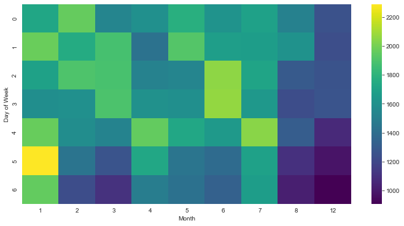
    


```python
sns.clustermap(dayMonth, cmap="viridis")
```


    <seaborn.matrix.ClusterGrid at 0x1e52c5b59d0>


    
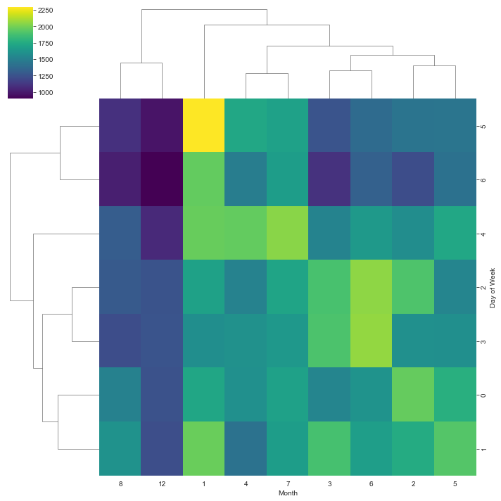
    

